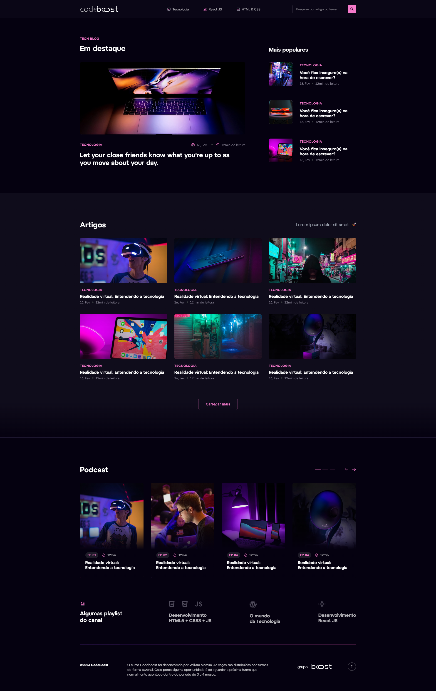

Projeto: Blog Codeboost

O Blog Codeboost é um projeto web criado para estudar as funcionalidades do wordpress voltadas na parte do blog.

## Screenshots

## Funcionalidades

- Slide com fade in (Swiper.js)
- Axios para fazer a leitura da API e integração
- Modal para detalhes do posts
- Multiplataforma
- Barra de pesquisa
- Categoria dos posts

## Stack utilizada

**Front-end:** HTML, CSS/SASS, Gulp, JS e bibliotecas

**CMS:** Wordpress

## Criador & Autor

- [@WillMoreiraDev](https://www.linkedin.com/in/willmoreira/)

- [@Vitor-Linaris](https://www.linkedin.com/in/vitor-linaris-a33a95235/)

## 🔗 Links

